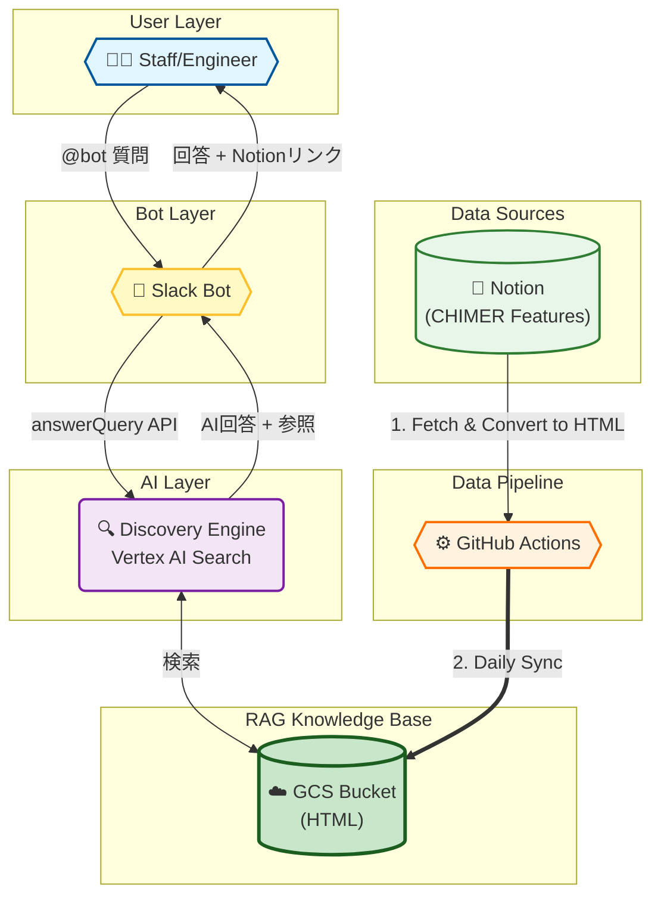
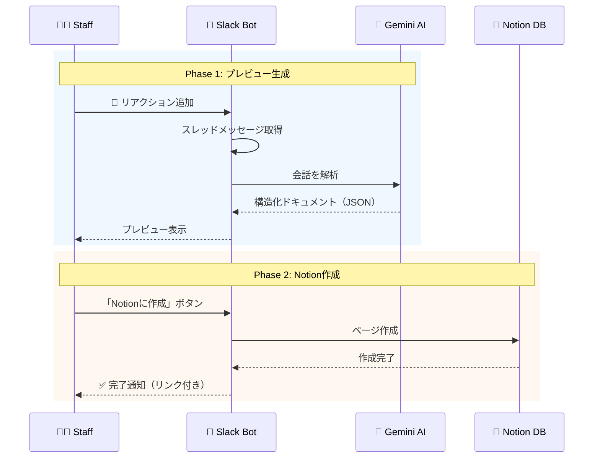

# syoya での経験をメモしておく

## React18/Next19 をつかって新規プロジェクト立ち上げ

## GCP/Cloud Run function/Vertex AI Applications つかった社内 RAG 及び Notion 連携

タイトル URL
Notion Integration
Slack App
GoogleCloud/Vertex AI Search
GoogleCloud/GCS
GoogleCloud/Cloud Run functions
GoogleCloud/Secret Manager
GoogleCloud/Vertex AI

### ラグ検索機能

### ドキュメント生成機能

## pino + cloud logging をつかったロギング戦略 for Next.js15 (Approuter)

client でのエラーか？server でのエラーか？を分けてロギングする

## Storybook 導入

## Playwright 導入

## v0 によるプロトタイピング
