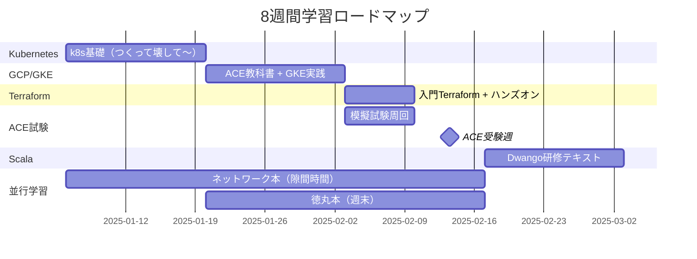
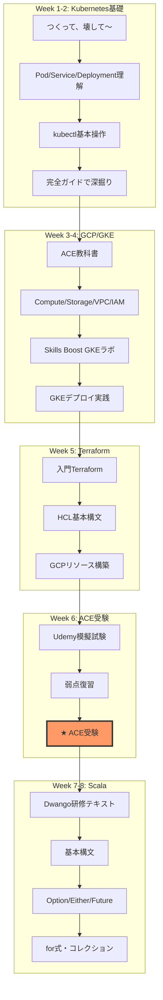
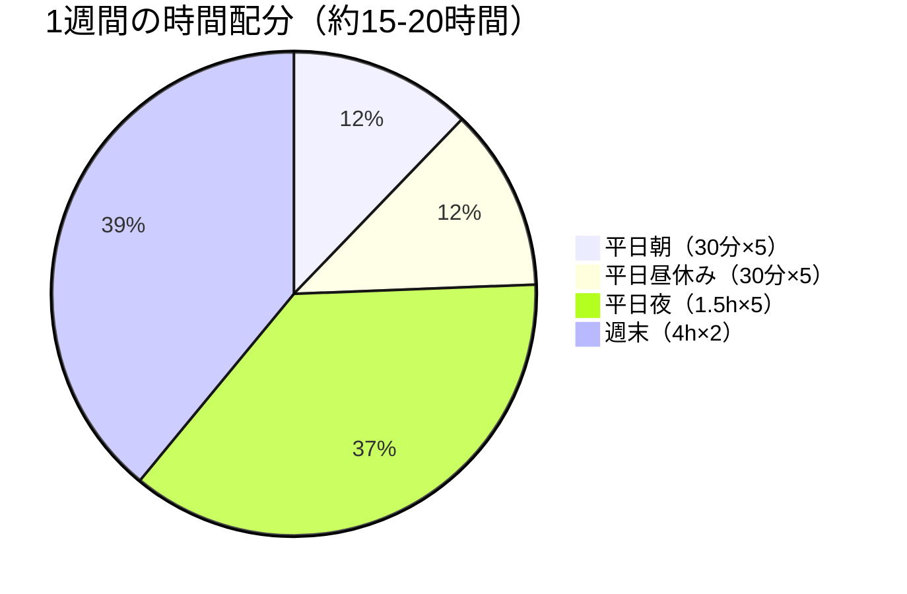
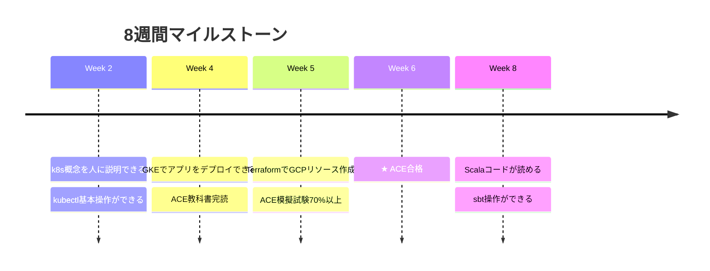

# 2ヶ月学習スケジュール（2025年1月〜2月）

## 目標

- **技術スタック習得**: Kubernetes / GCP / Terraform / Scala
- **資格取得**: Google Cloud Associate Cloud Engineer (ACE)
- **基礎固め**: ネットワーク / セキュリティ

---

## 全体スケジュール



---

## 学習フロー



---

## Week 1-2: Kubernetes基礎

### 目標

- Pod / Service / Deployment / ConfigMap / Secret を説明できる
- kubectlで基本操作ができる
- 「なぜk8sが必要か」を言語化できる

### 教材

| 種別 | 教材名 | 用途 |
|------|--------|------|
| 📕 メイン | つくって、壊して、直して学ぶ Kubernetes入門 | ハンズオン学習 |
| 📕 リファレンス | Kubernetes完全ガイド 第2版 | 辞書・深掘り |
| 🌐 環境 | [Killercoda](https://killercoda.com) | 無料ハンズオン環境 |

### 日別プラン

| 日 | 内容 | 時間 |
|----|------|------|
| Day 1-2 | 「つくって、壊して〜」第1-3章（k8s概念） | 3h |
| Day 3-4 | 同 第4-6章（Pod/ReplicaSet/Deployment） | 4h |
| Day 5-7 | 同 第7-9章（Service/Ingress/ConfigMap） | 4h |
| Day 8-10 | 同 第10-12章（トラブルシュート実践） | 4h |
| Day 11-14 | 「完全ガイド」で気になった箇所を深掘り | 3h |

### チェックポイント ✅

- [ ] Podとは何か説明できる
- [ ] Deployment/ReplicaSetの関係を説明できる
- [ ] Serviceの種類（ClusterIP/NodePort/LoadBalancer）を説明できる
- [ ] kubectl get/describe/logs/exec が使える

---

## Week 3-4: GCP/GKE + ACE学習開始

### 目標

- GCPの主要サービスを把握（Compute Engine / Cloud Storage / VPC / IAM / GKE）
- GKEでk8sクラスタを作成・デプロイできる
- ACE試験範囲の50%を理解

### 教材

| 種別 | 教材名 | 用途 |
|------|--------|------|
| 📕 メイン | 徹底攻略 Google Cloud認定資格 ACE教科書 | GCP学習 + 試験対策 |
| 🌐 ハンズオン | [Google Cloud Skills Boost](https://www.cloudskillsboost.google/) | GKE実機操作 |

### AWS → GCP 対応表（復習用）

```
AWS EC2        → GCP Compute Engine
AWS ALB        → GCP Cloud Load Balancing  
AWS VPC        → GCP VPC
AWS IAM        → GCP IAM
AWS S3         → GCP Cloud Storage
AWS RDS        → GCP Cloud SQL
```

### 日別プラン

| 日 | 内容 | 時間 |
|----|------|------|
| Day 1-3 | ACE教科書 第1-4章（GCP概要・Compute・Storage） | 5h |
| Day 4-5 | ACE教科書 第5-7章（ネットワーク・IAM） | 4h |
| Day 6-7 | Skills Boost: GKE入門ラボ（2-3個） | 3h |
| Day 8-10 | ACE教科書 第8-10章（GKE・運用・監視） | 5h |
| Day 11-12 | Skills Boost: GKEデプロイ実践ラボ | 3h |
| Day 13-14 | ACE教科書 残り + 章末問題 | 3h |

### チェックポイント ✅

- [ ] GCPコンソールでプロジェクト作成・IAM設定ができる
- [ ] gcloudコマンドの基本操作ができる
- [ ] GKEクラスタを作成し、アプリをデプロイできる
- [ ] VPC/サブネット/ファイアウォールルールを説明できる

---

## Week 5: Terraform + ACE問題集

### 目標

- Terraformでinit/plan/apply/destroyができる
- GCPリソース（VPC/GCE/GKE）をコードで管理できる
- ACE模擬試験で70%以上取れる

### 教材

| 種別 | 教材名 | 用途 |
|------|--------|------|
| 📕 メイン | 入門Terraform（インプレス, 2024/11） | IaC学習 |
| 🌐 試験対策 | Udemy ACE模擬試験 | 試験対策 |
| 🌐 追加演習 | [無料WEB問題集](https://it-concepts-japan.com/) | 隙間時間 |

### 日別プラン

| 日 | 内容 | 時間 |
|----|------|------|
| Day 1-2 | 「入門Terraform」第1-3章（IaC概念・基本構文・AWS例） | 4h |
| Day 3-4 | 同 第4章（マルチクラウド・GCP） | 3h |
| Day 5 | Terraform + GCPでVPC/GCE作成ハンズオン | 3h |
| Day 6-7 | **ACE Udemy模擬試験** 1回目 + 復習 | 4h |

### Terraform基本コマンド

```bash
terraform init      # 初期化
terraform plan      # 実行計画確認
terraform apply     # リソース作成
terraform destroy   # リソース削除
terraform fmt       # コード整形
```

### チェックポイント ✅

- [ ] HCLの基本構文（resource/variable/output）が書ける
- [ ] terraform init/plan/apply/destroy の流れを説明できる
- [ ] GCPのVPC/GCEをTerraformで作成できる
- [ ] ACE模擬試験で70%以上取れる

---

## Week 6: ACE受験週 🎯

### 目標

- **ACE合格**

### 日別プラン

| 日 | 内容 | 時間 |
|----|------|------|
| Day 1 | Udemy模擬試験 2回目 + 弱点洗い出し | 3h |
| Day 2 | 弱点分野をACE教科書で復習 | 2h |
| Day 3 | Udemy模擬試験 3回目 | 2h |
| Day 4 | 無料WEB問題集で追い込み | 2h |
| Day 5 | 軽く復習 + 早寝 | 1h |
| **Day 6** | **★ ACE受験** | - |
| Day 7 | 休息 or 振り返り | - |

### 試験情報

| 項目 | 内容 |
|------|------|
| 受験料 | $125（約19,000円） |
| 問題数 | 50問 |
| 試験時間 | 2時間 |
| 合格ライン | 非公開（70%程度と言われている） |
| 受験方法 | オンライン or テストセンター |

### 直前チェックリスト ✅

- [ ] gcloud / gsutil / kubectl コマンドの主要オプション
- [ ] IAMロールの種類と適用範囲
- [ ] VPCネットワーク設計のベストプラクティス
- [ ] GKEのノードプール/オートスケーリング設定
- [ ] Cloud Storageのストレージクラスと用途

---

## Week 7-8: Scala

### 目標

- Scalaの基本構文を理解
- Option / Either / Future の概念を掴む
- 簡単なコードが読める状態

### 教材

| 種別 | 教材名 | 用途 |
|------|--------|------|
| 🌐 メイン | [Dwango Scala研修テキスト](https://scala-text.github.io/scala_text/) | 無料・実務的 |
| 📕 補足 | 実践Scala入門（必要なら） | 深掘り用 |

### 日別プラン

| 日 | 内容 | 時間 |
|----|------|------|
| Day 1-3 | 環境構築 + 基本構文（val/var/def/if/match） | 5h |
| Day 4-6 | クラス・オブジェクト・トレイト | 5h |
| Day 7-9 | コレクション（List/Map/Set）・Option・Either | 5h |
| Day 10-12 | Future・for式（for内包表記） | 4h |
| Day 13-14 | sbt操作練習 + サンプルコード写経 | 3h |

### Scala基本構文メモ

```scala
// 変数
val immutable = "変更不可"
var mutable = "変更可能"

// 関数
def greet(name: String): String = s"Hello, $name"

// Option（null安全）
val maybeValue: Option[String] = Some("value")
val nothing: Option[String] = None

// パターンマッチ
maybeValue match {
  case Some(v) => println(v)
  case None => println("empty")
}

// for式
for {
  x <- List(1, 2, 3)
  y <- List(10, 20)
} yield x * y
```

### チェックポイント ✅

- [ ] val/var の違いを説明できる
- [ ] Option/Some/None の使い方がわかる
- [ ] Either[Left, Right] の用途がわかる
- [ ] for式（for内包表記）が読める
- [ ] sbt compile / sbt run ができる

---

## 並行学習（隙間時間）

### ネットワーク基礎

| 教材 | 読み方 | 期間 |
|------|--------|------|
| 📕 ネットワークはなぜつながるのか 第2版 | 通勤・就寝前に15-30分 | Week 1-6 |

**学ぶこと**: ブラウザにURLを入力 → Webページ表示までの全工程（DNS/HTTP/TCP/IP）

### セキュリティ基礎

| 教材 | 読み方 | 期間 |
|------|--------|------|
| 📕 体系的に学ぶ安全なWebアプリケーションの作り方 第2版（徳丸本） | 週末に1-2時間 | Week 3-6 |

**優先して読む章**:

- 第4章: Webアプリケーションの機能別に見るセキュリティバグ
  - 4.3 XSS（クロスサイトスクリプティング）
  - 4.4 SQLインジェクション
  - 4.5 CSRF（クロスサイトリクエストフォージェリ）

---

## 週間スケジュール例



### 平日

| 時間帯 | 内容 | 時間 |
|--------|------|------|
| 朝 | ネットワーク本 or 徳丸本 | 30分 |
| 昼休み | 問題集（ACE対策期間） | 30分 |
| 夜 | メイン学習 | 1.5-2時間 |

### 週末

| 時間帯 | 内容 | 時間 |
|--------|------|------|
| 午前〜午後 | ハンズオン・集中学習 | 3-4時間/日 |

---

## マイルストーン



---

## 参考リンク

### Kubernetes

- [Kubernetes公式ドキュメント](https://kubernetes.io/ja/docs/home/)
- [Killercoda（無料ハンズオン）](https://killercoda.com)

### GCP

- [Google Cloud Skills Boost](https://www.cloudskillsboost.google/)
- [ACE試験ガイド](https://cloud.google.com/learn/certification/cloud-engineer)

### Terraform

- [Terraform公式ドキュメント](https://developer.hashicorp.com/terraform/docs)
- [Terraform Registry（GCPプロバイダ）](https://registry.terraform.io/providers/hashicorp/google/latest/docs)

### Scala

- [Dwango Scala研修テキスト](https://scala-text.github.io/scala_text/)
- [Scala公式ドキュメント](https://docs.scala-lang.org/ja/)

---

## 備考

- 転職先でScala 2系 or 3系か要確認
- 学習ペースは調整可能（週15-20時間想定）
- ACE受験日は余裕を持って予約
