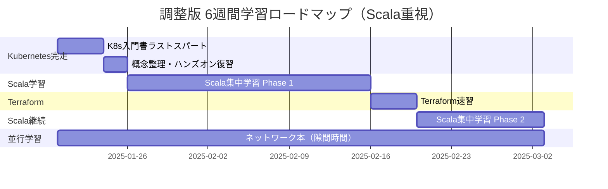
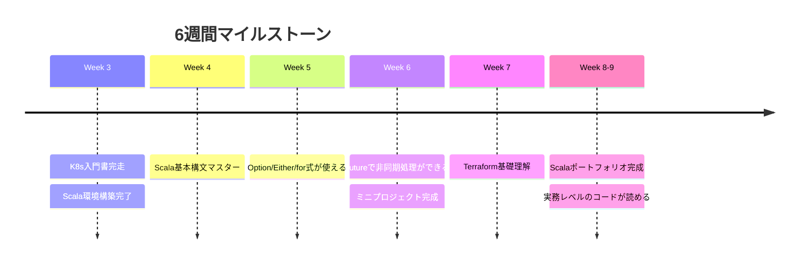

# 調整版 学習計画（Scala重視）

> **調整日**: 2025/1/20  
> **方針**: プロダクトエンジニアとしてScala/FE/BE中心。K8s/Terraformは概念理解のみ。ACE受験は保留。

---

## 🎯 目標

- **最優先**: Scala習得（実務で即戦力レベル）
- **重要**: K8s概念理解（最低限のトラブルシュート可能）
- **次点**: Terraform基礎（IaCの概念理解）
- **保留**: ACE受験（3月以降に延期可）

---

## 📊 進捗状況（1/19時点）

- ✅ K8s入門書: 250/350p（71%完了）
- ⏳ 残タスク: 100p + 概念整理
- 📅 残り期間: 約6週間（1/20 - 3/2）

---

## 📅 調整後スケジュール



---

## 🗓️ Week 3: K8s完走 + Scala開始（1/20 - 1/26）

### Week 3 目標

- K8s入門書を完走する
- Scalaの環境構築 + 基本構文に触れる

### Week 3 日次プラン

| 日 | 内容 | 時間 |
| ---- | ------ | ------ |
| 1/20 (月) | K8s入門書 残り100p（流し読みモード開始） | 3h |
| 1/21 (火) | K8s入門書 続き + 重要箇所マーキング | 3h |
| 1/22 (水) | K8s入門書 完走 🎉 | 2h |
| 1/23 (木) | K8s概念整理（Pod/Service/Deployment/ConfigMap/Secret） | 2h |
| 1/24 (金) | kubectl基本操作の復習 + チートシート作成 | 2h |
| 1/25 (土) | Scala環境構築（sbt/IntelliJ） + Hello World | 3h |
| 1/26 (日) | Dwango研修テキスト 第1章（基本構文） | 4h |

### Week 3 チェックポイント ✅

- [ ] K8s入門書を最後まで読了
- [ ] 以下の概念を説明できる
  - [ ] Pod / Deployment / Service の役割
  - [ ] ConfigMap / Secret の使い分け
  - [ ] kubectl の基本コマンド（get/describe/logs/exec）
- [ ] Scala開発環境が動作する
- [ ] Scala基本構文（val/var/def）が書ける

---

## 🗓️ Week 4-6: Scala集中学習 Phase 1（1/27 - 2/16）

### Week 4-6 目標

- Scalaの基本構文をマスター
- 関数型プログラミングの概念理解
- Option / Either / Future を実践的に使える

### 使用教材

| 種別 | 教材名 | 用途 |
| ---- | ------ | ---- |
| 🌐 メイン | [Dwango Scala研修テキスト](https://scala-text.github.io/scala_text/) | 無料・実務的 |
| 📕 補足 | 実践Scala入門 | 深掘り用 |
| 🌐 演習 | [Scala Exercises](https://www.scala-exercises.org/) | 実践演習 |

### 3週間集中プラン

#### Week 4（1/27 - 2/2）: 基礎固め

| 日 | 内容 | 時間 |
| ---- | ------ | ------ |
| Day 1-2 | Dwango第2-3章（制御構文・クラス・オブジェクト） | 各4h |
| Day 3-4 | Dwango第4章（トレイト・パターンマッチ） | 各4h |
| Day 5-6 | Dwango第5章（コレクション操作） | 各4h |
| Day 7 | 週の復習 + サンプルコード写経 | 4h |

**週末チェック**:

- [ ] クラス/オブジェクト/トレイトの違いを説明できる
- [ ] パターンマッチを使ったコードが書ける
- [ ] List/Map/Setの基本操作ができる

#### Week 5（2/3 - 2/9）: 関数型プログラミング

| 日 | 内容 | 時間 |
| ---- | ------ | ------ |
| Day 1-2 | Dwango第6章（Option・Either） | 各4h |
| Day 3-4 | Dwango第7章（for式・内包表記） | 各4h |
| Day 5-6 | Option/Eitherを使った実践演習 | 各4h |
| Day 7 | 週の復習 + エラーハンドリング整理 | 4h |

**週末チェック**:

- [ ] Option/Some/Noneでnull安全に書ける
- [ ] Either[Left, Right]でエラーハンドリングできる
- [ ] for式を使った処理が書ける

#### Week 6（2/10 - 2/16）: 非同期・実践

| 日 | 内容 | 時間 |
| ---- | ------ | ------ |
| Day 1-2 | Dwango第8章（Future・非同期処理） | 各4h |
| Day 3-4 | Futureを使った実践演習 | 各4h |
| Day 5-6 | ミニプロジェクト作成（REST API or CLI） | 各5h |
| Day 7 | ポートフォリオ整理 + Phase 1振り返り | 3h |

**週末チェック**

- [ ] Futureの基本的な使い方がわかる
- [ ] 非同期処理のエラーハンドリングができる
- [ ] 簡単なアプリケーションが作れる

---

## 🗓️ Week 7: Terraform速習（2/17 - 2/23）

### Week 7 目標

- IaC（Infrastructure as Code）の概念理解
- Terraformの基本操作ができる
- GCPリソースをコードで管理できる（最低限）

### 使用教材

| 種別 | 教材名 | 用途 |
| ---- | ------ | ---- |
| 📕 メイン | 入門Terraform（インプレス, 2024/11） | IaC学習 |
| 🌐 実践 | GCP公式チュートリアル | ハンズオン |

### 4日間速習プラン

| 日 | 内容 | 時間 |
| ---- | ------ | ------ |
| 2/17 (月) | 入門Terraform 第1-2章（IaC概念・基本構文） | 3h |
| 2/18 (火) | 入門Terraform 第3章（リソース管理・状態管理） | 3h |
| 2/19 (水) | 入門Terraform 第4章（GCPプロバイダ） | 3h |
| 2/20 (木) | ハンズオン: GCPでVPC/Compute Engine作成 | 4h |

### Terraform基本コマンド

```bash
terraform init      # 初期化
terraform plan      # 実行計画確認
terraform apply     # リソース作成
terraform destroy   # リソース削除
terraform fmt       # コード整形
```

### Week 7 チェックポイント ✅

- [ ] IaCの概念を説明できる
- [ ] HCLの基本構文（resource/variable/output）が書ける
- [ ] terraform init/plan/apply/destroy の流れを理解
- [ ] GCPの簡単なリソースをTerraformで作成できる

**※ 深入りしない**: コンセプト理解と基本操作のみ。実務で学ぶ前提。

---

## 🗓️ Week 8-9: Scala Phase 2 + 仕上げ（2/21 - 3/2）

### Week 8-9 目標

- Scalaの実践力を高める
- より複雑なコードを読み書きできる
- ポートフォリオ作品を完成させる

### 10日間集中プラン

| 日 | 内容 | 時間 |
| ---- | ------ | ------ |
| Day 1-2 | Dwango応用編（implicit/型クラス） | 各3h |
| Day 3-4 | sbt操作練習 + ライブラリ活用 | 各3h |
| Day 5-7 | プロダクトレベルのコード写経（GitHubから） | 各4h |
| Day 8-10 | ポートフォリオ作品の仕上げ + README | 各5h |

### Week 8-9 チェックポイント ✅

- [ ] implicitの基本を理解
- [ ] sbt compile/run/testが使える
- [ ] 外部ライブラリ（Cats/http4sなど）に触れた
- [ ] GitHubに公開できるコードがある

---

## 📚 並行学習（隙間時間）

### ネットワーク基礎（継続）

| 教材 | 読み方 | 期間 |
| ---- | ------ | ---- |
| 📕 ネットワークはなぜつながるのか 第2版 | 通勤・就寝前に15-30分 | Week 3-8 |

**学ぶこと**: DNS/HTTP/TCP/IPの基礎（k8s/GCPの理解にも役立つ）

---

## 🎯 最終成果物

### 6週間後のゴール

1. **Scala**
   - ✅ 基本構文を自在に書ける
   - ✅ Option/Either/Futureを実務レベルで使える
   - ✅ GitHubにポートフォリオコードがある

2. **Kubernetes**
   - ✅ 主要リソース（Pod/Service/Deployment）を説明できる
   - ✅ kubectl基本操作ができる
   - ✅ トラブル時にログを確認できる

3. **Terraform**
   - ✅ IaCの概念を理解している
   - ✅ 基本的なHCLが読める
   - ✅ GCPリソースを簡単に作成できる

---

## ⏰ 週間スケジュール例

### 平日（月-金）

| 時間帯 | 内容 | 時間 |
| ---- | ------ | ---- |
| 朝 | ネットワーク本 | 20-30分 |
| 昼休み | 技術記事・Scala Exercises | 30分 |
| 夜 | メイン学習（Scala中心） | 2-3時間 |

### 週末（土日）

| 時間帯 | 内容 | 時間 |
| ---- | ------ | ---- |
| 午前-午後 | 集中学習・ハンズオン・コード写経 | 4-6時間/日 |

**合計**: 週15-25時間（Scalaに週12-18時間確保）

---

## 📝 学習Tips

### Scala学習のコツ

1. **写経を重視**
   - 理論より実践。コードを書いて動かす
   - GitHubの実際のプロジェクトを読む

2. **エラーを恐れない**
   - コンパイルエラーは友達
   - REPL（sbt console）で試行錯誤

3. **コミュニティ活用**
   - [Scala公式Discord](https://discord.com/invite/scala)
   - Stack Overflow / Reddit

### K8s/Terraformの学習スタンス

- **完璧を目指さない**: 概念理解と基本操作のみ
- **実務で学ぶ前提**: チームに聞ける環境がある
- **手を動かす**: ドキュメント読むより触る

---

## 🔄 調整ポイント

### ACE受験について

- **延期推奨**: 3月中旬以降
- **理由**: Scala習得を最優先
- **メリット**: 実務経験後の方が理解が深まる

### もし時間が余ったら

1. **Scalaをさらに深掘り**
   - Cats / ZIO などのライブラリ
   - Play Framework / http4s（Webフレームワーク）

2. **フロントエンド復習**
   - React / TypeScript
   - 既に経験あるなら軽く復習

3. **バックエンド設計**
   - Clean Architecture
   - DDD（ドメイン駆動設計）

---

## 📌 マイルストーン



---

## 🚀 転職に向けて

### アピールポイント

1. **Scalaの実践経験**
   - GitHubリポジトリ
   - 関数型プログラミングの理解

2. **Cloud経験**
   - GCP（Cloud Run / Cloud Functions）
   - AWSの基礎知識
   - K8s概念理解

3. **IaC経験**
   - Terraformの基礎

### 面接で話せること

- 「K8sの基本は理解しており、実務でキャッチアップできます」
- 「Scalaは6週間集中して学習し、ポートフォリオも作成しました」
- 「GCPでサーバーレスアプリ開発経験があります」

---

## 📚 参考リンク

### Scala

- [Dwango Scala研修テキスト](https://scala-text.github.io/scala_text/)
- [Scala公式ドキュメント](https://docs.scala-lang.org/ja/)
- [Scala Exercises](https://www.scala-exercises.org/)

### Kubernetes

- [Kubernetes公式ドキュメント](https://kubernetes.io/ja/docs/home/)
- [kubectl チートシート](https://kubernetes.io/ja/docs/reference/kubectl/cheatsheet/)

### Terraform

- [Terraform公式ドキュメント](https://developer.hashicorp.com/terraform/docs)
- [GCP Terraform Provider](https://registry.terraform.io/providers/hashicorp/google/latest/docs)

---

## 💪 最後に

**プロダクトエンジニアとして必要なスキルに集中する**ことが最も重要です。

- Scalaは実務で即使うので最優先
- K8s/Terraformは「概念を知っている」レベルでOK
- 実務に入ってからチームで学べる部分は任せる

**焦らず、確実に。1つずつマスターしていきましょう！🎯**
