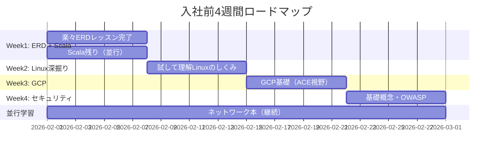
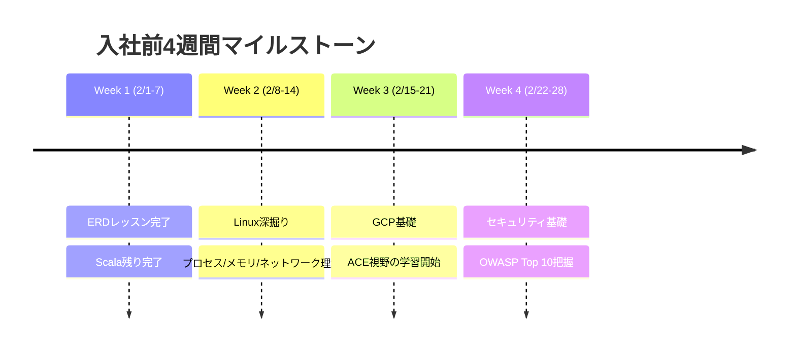

# 学習計画 v03（基礎強化）

> **作成日**: 2026/2/1
> **入社予定日**: 2026/3/1
> **方針**: 言語非依存の基礎（Linux仕組み/DB設計/GCP/セキュリティ）を固める

---

## 🎯 目標

### 入社前（2/1〜2/28）4週間

- **DB設計**: 楽々ERDレッスン完了（すでに3章進行中）
- **Scala**: ドワンゴ教材を完了（深追いしない）
- **Linux**: 仕組みの深掘り（プロセス/メモリ/ネットワーク）
- **GCP**: ACE受験も視野に入れた基礎学習
- **セキュリティ**: 基礎概念、OWASP Top 10
- **Terraform**: 入社後に学習（今回は対象外）

### 入社後（3/1〜）

- **実務**: TypeScript + React Router（Scalaからのリプレイス対応）
- **継続**: 基礎知識の深掘り + Terraform

---

## 📊 前回からの引き継ぎ

| 項目 | 状況 |
| ---- | ---- |
| Scala | classの概念まで理解済み。Future/関数構文はこれから |
| K8s | 入門書完走済み（概念理解OK） |
| Terraform | 未着手 |

---

## 📅 入社前4週間スケジュール



---

## 🗓️ Week 1: ERDレッスン完了 + Scala（2/1 - 2/7）

### Week 1 目標

- 楽々ERDレッスンを完了（3章から継続）
- Scalaドワンゴ教材の残り（Option/Either/Future概念まで）

### 使用教材

| 種別 | 教材名 | 用途 |
| ---- | ------ | ---- |
| 📕 メイン | 楽々ERDレッスン | DB設計パターン |
| 🌐 並行 | Dwango Scala研修テキスト | Scala基礎 |

### Week 1 日次プラン

| 日 | 内容 | 時間 |
| ---- | ------ | ------ |
| 2/1 (土) | ERDレッスン 第3章実践（継続） | 4h |
| 2/2 (日) | ERDレッスン 第4-5章（設計パターン） | 4h |
| 2/3 (月) | ERDレッスン 残り + 復習 | 3h |
| 2/4 (火) | Scala: Option/Eitherの基本 | 3h |
| 2/5 (水) | Scala: for式・コレクション操作 | 3h |
| 2/6 (木) | Scala: Futureの概念理解 | 2h |
| 2/7 (金) | Scala: ドワンゴ残り流し読み + まとめ | 2h |

### Week 1 チェックポイント ✅

- [ ] 楽々ERDレッスンを完了
- [ ] 正規化（1NF〜3NF）を説明できる
- [ ] 主要な設計パターン（マスタ/トランザクション、履歴テーブル等）を理解
- [ ] Scalaドワンゴ教材を一通り完了
- [ ] Option/Either/Futureの概念を説明できる

---

## 🗓️ Week 2: Linux深掘り（2/8 - 2/14）

### Week 2 目標

- Linuxの内部動作（プロセス/メモリ/ファイルシステム/ネットワーク）を理解
- K8s/GCPインフラを扱う際の基礎知識を固める
- ※基本コマンドは既知のためスキップ

### 使用教材

| 種別 | 教材名 | 用途 |
| ---- | ------ | ---- |
| 📕 メイン | 試して理解 Linuxのしくみ 増補改訂版（武内覚） | 内部動作の図解・実験 |
| 🌐 補足 | [Linux Journey](https://linuxjourney.com/) | 復習用 |

### Week 2 日次プラン

| 日 | 内容 | 時間 |
| ---- | ------ | ------ |
| 2/8 (土) | 第1-2章: プロセス管理（fork/exec、スケジューラ） | 4h |
| 2/9 (日) | 第3章: メモリ管理（仮想メモリ、ページング、スワップ） | 4h |
| 2/10 (月) | 第4章: ファイルシステム（inode、ジャーナリング） | 3h |
| 2/11 (火) | 第5章: ストレージ（ブロックデバイス、RAID） | 3h |
| 2/12 (水) | 第6章: ネットワーク（ソケット、TCP/IP、ルーティング） | 3h |
| 2/13 (木) | 第7章: コンテナ技術の基礎（namespace、cgroups） | 3h |
| 2/14 (金) | 週の復習・K8sとの関連付け整理 | 2h |

### Week 2 チェックポイント ✅

- [ ] プロセスの生成（fork/exec）を説明できる
- [ ] 仮想メモリとページングの仕組みを理解
- [ ] ファイルシステムの構造（inode等）を説明できる
- [ ] TCP/IPスタックの基本を理解
- [ ] namespace/cgroupsがコンテナの基礎であることを理解

### Linuxの仕組み（インフラ視点で重要な概念）

```
プロセス管理
├── fork/exec: プロセス生成の仕組み
├── スケジューラ: CPU時間の割り当て
└── シグナル: プロセス間通信

メモリ管理
├── 仮想メモリ: プロセスごとのアドレス空間
├── ページング: 物理メモリの効率的利用
└── OOM Killer: メモリ不足時の挙動

コンテナ基礎
├── namespace: リソースの分離
├── cgroups: リソース制限
└── → K8sのPod/コンテナに直結
```

---

## 🗓️ Week 3: GCP基礎（2/15 - 2/21）

### Week 3 目標

- GCPの主要サービスを理解
- ACE（Associate Cloud Engineer）受験を視野に入れた学習
- 実際にリソースを触って理解を深める

### 使用教材

| 種別 | 教材名 | 用途 |
| ---- | ------ | ---- |
| 🌐 メイン | [Google Cloud Skills Boost](https://www.cloudskillsboost.google/) | 公式ラーニングパス |
| 📕 推奨 | GCP Associate Cloud Engineer認定資格ガイド | ACE対策 |
| 🌐 実践 | GCP無料枠 | ハンズオン |

### Week 3 日次プラン

| 日 | 内容 | 時間 |
| ---- | ------ | ------ |
| 2/15 (土) | GCP概要・IAM・プロジェクト構造 | 4h |
| 2/16 (日) | Compute Engine・ネットワーク（VPC/サブネット/ファイアウォール） | 4h |
| 2/17 (月) | Cloud Storage・Cloud SQL | 3h |
| 2/18 (火) | GKE（Google Kubernetes Engine）基礎 | 3h |
| 2/19 (水) | Cloud Run・Cloud Functions（サーバーレス） | 3h |
| 2/20 (木) | Cloud Monitoring・Cloud Logging | 3h |
| 2/21 (金) | 週の復習・ACE出題範囲確認 | 2h |

### Week 3 チェックポイント ✅

- [ ] GCPの主要サービスを説明できる
- [ ] IAMの概念（ロール/サービスアカウント）を理解
- [ ] VPCとネットワーク構成を理解
- [ ] GKEとK8sの関係を説明できる
- [ ] サーバーレス（Cloud Run/Functions）の使い分けがわかる

### GCP主要サービス一覧

```
コンピューティング
├── Compute Engine: 仮想マシン
├── GKE: マネージドK8s
├── Cloud Run: コンテナサーバーレス
└── Cloud Functions: 関数サーバーレス

ストレージ/DB
├── Cloud Storage: オブジェクトストレージ
├── Cloud SQL: マネージドRDB
├── Firestore: NoSQL
└── BigQuery: データウェアハウス

ネットワーク
├── VPC: 仮想ネットワーク
├── Cloud Load Balancing: ロードバランサー
└── Cloud CDN: コンテンツ配信

運用
├── Cloud Monitoring: 監視
├── Cloud Logging: ログ管理
└── IAM: アクセス管理
```

### ACE試験について

| 項目 | 内容 |
| ---- | ---- |
| 試験時間 | 2時間 |
| 問題数 | 約50問（選択式） |
| 合格ライン | 非公開（約70%程度と言われる） |
| 受験料 | $125 |
| 有効期限 | 2年 |

**入社後に受験予定**: 実務経験を積んでから受験するとより理解が深まる

---

## 🗓️ Week 4: セキュリティ基礎（2/22 - 2/28）

### Week 4 目標

- セキュリティの基本概念を理解
- OWASP Top 10を把握
- 安全なコードを書くための意識を持つ

### 使用教材

| 種別 | 教材名 | 用途 |
| ---- | ------ | ---- |
| 🌐 メイン | [OWASP Top 10](https://owasp.org/Top10/) | 脆弱性リスト |
| 📕 推奨 | 体系的に学ぶ 安全なWebアプリケーションの作り方（徳丸本） | 実践的なセキュリティ |
| 🌐 演習 | [OWASP WebGoat](https://owasp.org/www-project-webgoat/) | ハンズオン |

### Week 4 日次プラン

| 日 | 内容 | 時間 |
| ---- | ------ | ------ |
| 2/22 (土) | セキュリティ概論・CIA三要素・認証/認可 | 4h |
| 2/23 (日) | OWASP Top 10 概要（各脆弱性の理解） | 4h |
| 2/24 (月) | インジェクション系（SQL/Command/XSS） | 3h |
| 2/25 (火) | 認証系（Broken Authentication/CSRF） | 3h |
| 2/26 (水) | その他脆弱性（SSRF/Insecure Deserialization等） | 3h |
| 2/27 (木) | 安全なコーディング実践（入力検証・エスケープ） | 3h |
| 2/28 (金) | 入社前総復習・学習成果まとめ | 3h |

### Week 4 チェックポイント ✅

- [ ] CIA三要素（機密性/完全性/可用性）を説明できる
- [ ] OWASP Top 10の各項目を把握している
- [ ] 主要な脆弱性と対策を説明できる
  - [ ] SQLインジェクション → パラメータ化クエリ
  - [ ] XSS → エスケープ/CSP
  - [ ] CSRF → トークン検証
- [ ] 入力検証の重要性を理解している

### OWASP Top 10 (2021) 概要

| # | 脆弱性 | 対策 |
| -- | ------ | ---- |
| A01 | Broken Access Control | 適切な認可チェック |
| A02 | Cryptographic Failures | 強力な暗号化 |
| A03 | Injection | パラメータ化・エスケープ |
| A04 | Insecure Design | セキュアな設計原則 |
| A05 | Security Misconfiguration | デフォルト設定の見直し |
| A06 | Vulnerable Components | 依存関係の更新 |
| A07 | Auth Failures | 多要素認証 |
| A08 | Software/Data Integrity | 署名検証 |
| A09 | Logging Failures | 適切なログ記録 |
| A10 | SSRF | URL検証 |

---

## 📚 並行学習（継続）

### ネットワーク基礎

| 教材 | 読み方 | 期間 |
| ---- | ------ | ---- |
| 📕 ネットワークはなぜつながるのか 第2版 | 通勤・就寝前に15-30分 | 継続 |

---

## 🚀 入社後の学習方向性（3/1〜）

### 実務キャッチアップ

1. **TypeScript + React Router**
   - Scalaからのリプレイス対応
   - 実務コードを読みながら学習
   - 必要に応じて公式ドキュメント参照

2. **チームの技術スタック**
   - 使用フレームワーク・ライブラリの把握
   - 開発フロー・CI/CDの理解

### 入社後に学習予定

| 分野 | 方向性 | 優先度 |
| ---- | ------ | ------ |
| **Terraform** | IaC基礎、GCPプロバイダ、init/plan/apply | 高 |
| GCP ACE | 実務経験を積んでから受験 | 中 |
| Linux | より深い仕組み（I/O、カーネルチューニング） | 中 |
| セキュリティ | 実務で遭遇した課題の深掘り | 低 |

### Terraform学習計画（入社後）

```
Phase 1: 基礎（1-2週間）
├── IaCの概念理解
├── HCL基本構文（resource/variable/output）
└── terraform init/plan/apply/destroy

Phase 2: 実践（実務と並行）
├── GCPリソースのコード化
├── モジュール化
└── 状態管理（tfstate）
```

### 中期目標（3ヶ月後）

- [ ] 実務のコードベースを理解し、独力で機能追加できる
- [ ] TypeScript/Reactでの開発に習熟
- [ ] Terraformで基本的なリソース管理ができる
- [ ] GCP ACE受験準備が整っている

---

## ⏰ 週間スケジュール例

### 平日（月-金）

| 時間帯 | 内容 | 時間 |
| ---- | ------ | ---- |
| 朝 | ネットワーク本 | 20-30分 |
| 昼休み | 技術記事・ドキュメント | 30分 |
| 夜 | メイン学習 | 2-3時間 |

### 週末（土日）

| 時間帯 | 内容 | 時間 |
| ---- | ------ | ---- |
| 午前-午後 | 集中学習・ハンズオン | 4-6時間/日 |

**合計**: 週15-25時間

---

## 📌 マイルストーン



---

## 🎯 入社時点でのゴール

### 技術スキル

1. **DB設計**
   - ✅ 正規化を理解している
   - ✅ 基本的な設計パターンを知っている

2. **Scala**
   - ✅ 基本構文を理解（深い実装は不要）
   - ✅ コードリーディングができる

3. **Linux**
   - ✅ 内部動作（プロセス/メモリ/ネットワーク）を理解
   - ✅ コンテナ技術の基礎（namespace/cgroups）を把握

4. **GCP**
   - ✅ 主要サービスを説明できる
   - ✅ ACE受験の基礎知識がある

5. **セキュリティ**
   - ✅ 主要な脆弱性と対策を把握
   - ✅ 安全なコードを意識できる

### マインドセット

- 言語非依存の基礎を固めた状態
- 新しい技術スタック（TS/React）を学ぶ準備ができている
- 分からないことを調べる力がある

---

## 📝 学習Tips

### 基礎学習のコツ

1. **概念を先に理解**
   - なぜその技術が必要か
   - どういう問題を解決するか

2. **手を動かす**
   - 読むだけでなく実際に試す
   - 小さな実験を繰り返す

3. **アウトプット**
   - 学んだことをノートにまとめる
   - 説明できるレベルを目指す

### 入社後の学習スタンス

- 実務優先で学ぶ
- チームメンバーに積極的に質問
- 分からないことは恥ずかしがらない

---

## 🔗 参考リンク

### Linux

- [Linux Journey](https://linuxjourney.com/)
- [試して理解 Linuxのしくみ（書籍）](https://gihyo.jp/book/2022/978-4-297-13148-7)

### GCP

- [Google Cloud Skills Boost](https://www.cloudskillsboost.google/)
- [GCP公式ドキュメント](https://cloud.google.com/docs)
- [ACE試験ガイド](https://cloud.google.com/certification/cloud-engineer)

### DB設計

- [dbdiagram.io](https://dbdiagram.io/)
- 楽々ERDレッスン（書籍）

### セキュリティ

- [OWASP Top 10](https://owasp.org/Top10/)
- [OWASP Cheat Sheet Series](https://cheatsheetseries.owasp.org/)

### Terraform（入社後）

- [Terraform公式ドキュメント](https://developer.hashicorp.com/terraform/docs)
- [GCP Terraform Provider](https://registry.terraform.io/providers/hashicorp/google/latest/docs)

### Scala（参考）

- [Dwango Scala研修テキスト](https://scala-text.github.io/scala_text/)

---

## 💪 最後に

**言語に依存しない基礎力**を身につけることで、どんな技術スタックにも対応できるエンジニアを目指します。

- DB設計・Linux・セキュリティは今後のキャリアでずっと使える知識
- GCPの基礎を固めて、ACE受験の土台を作る
- Terraformは入社後に実務と並行して習得
- 入社後はTypeScript/React Routerを実務で習得

**基礎を固めて、自信を持って入社しましょう！**
