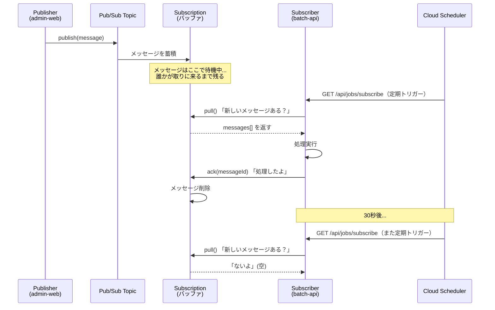
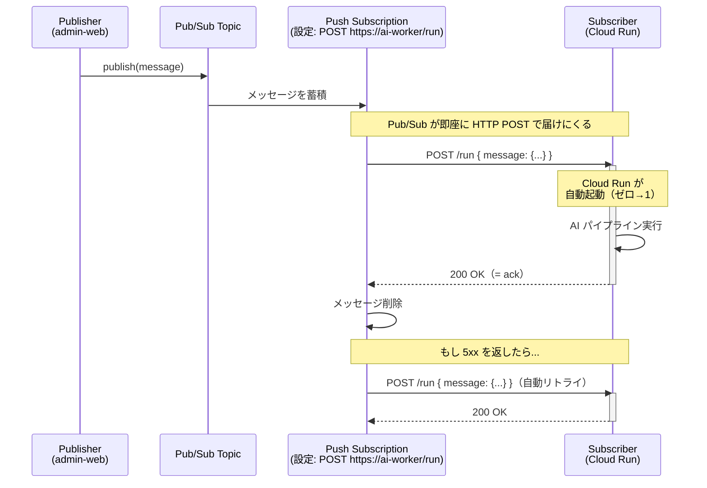

---
tags:
  - gcp
  - pub-sub
  - messaging
created_at: 2026-05-05
updated_at: 2026-05-05
status: active
---

# Pub/Sub (Google Cloud)

## そもそも Pub/Sub の登場人物

```text
Publisher (発行者)        Topic (郵便ポスト)        Subscription (届け先)        Subscriber (受取人)

メッセージを              メッセージを              「誰に届けるか」の           メッセージを
送る側                    貯めておく場所            設定・バッファ              受け取って処理する側
```

重要なのは **Topic と Subscriber の間に Subscription が挟まる** こと。Subscription が「届け方」を決める。その届け方が **Pull か Push か** という話。

---

## Pull 型: 「自分で取りに行く」



このプロジェクトの現行コード（batch-api）がまさにこれ:

```scala
// batch-api: Cloud Scheduler に叩かれて pull する
val messages = delegatedJobRepository.pullMessages()  // ← 自分で取りに行く
messages.foreach { msg =>
  delegatedJobActor ! msg.payload
}
delegatedJobRepository.acknowledge(ackIds)            // ← 処理完了を通知
```

### Pull のメンタルモデル: コンビニ受取

- 荷物（メッセージ）はコンビニ（Subscription）に届く
- 自分の好きなタイミングで取りに行く
- 取りに行かない限り、荷物はコンビニに置かれたまま

### Pull の特性

| 特性 | 説明 |
|---|---|
| 消費ペースの制御 | Subscriber が自分のペースで取れる。処理能力を超えない |
| レイテンシ | ポーリング間隔分の遅延が必ず生じる（30 秒〜数分） |
| 常時起動 | 取りに行く側が動いていないと処理されない |
| バッチ向き | まとめて pull → まとめて処理が自然 |

---

## Push 型: 「届けてもらう」



M7 安定稼働時のイメージコード:

```typescript
// ai-worker (Cloud Run): Pub/Sub が直接 POST してくる
export const action = async ({ request }: ActionFunctionArgs) => {
  // Pub/Sub Push が送ってくるエンベロープ形式
  const envelope = await request.json();
  // {
  //   "message": {
  //     "data": "eyJyZXZpZXdJZCI6Ii4uLiJ9",  ← base64
  //     "messageId": "123456",
  //     "publishTime": "2026-04-14T..."
  //   },
  //   "subscription": "projects/.../subscriptions/ai-review"
  // }

  const payload = JSON.parse(
    Buffer.from(envelope.message.data, "base64").toString()
  );

  await orchestrator.run(payload);

  return new Response("ok", { status: 200 });
  // ↑ 200 を返す = ack（Pub/Sub がメッセージを削除）
  // ↑ 5xx を返す = nack（Pub/Sub が自動リトライ）
};
```

### Push のメンタルモデル: 宅配便

- 荷物（メッセージ）が届いたら、配達員（Pub/Sub）が玄関まで届けにくる
- 在宅なら受け取れる（200 OK）→ 配達完了
- 不在なら不在票（5xx）→ 再配達（リトライ）
- 家が建っていなくても、配達が来たら家が建つ（Cloud Run ゼロスケール → 自動起動）

### Push の特性

| 特性 | 説明 |
|---|---|
| リアルタイム | publish 直後に HTTP POST が飛ぶ。ポーリング遅延なし |
| 自動起動 | Cloud Run + Push なら、メッセージ到着で自動起動 → 処理 → ゼロスケール |
| リトライ自動化 | HTTP レスポンスコードで ack/nack が決まる。リトライは Pub/Sub 任せ |
| 流量制御が難しい | Pub/Sub が一気に POST してくるので、Subscriber 側で制御しにくい |

---

## 決定的な違いの図解

```text
【Pull】                          【Push】

  Subscription                      Subscription
  ┌──────────┐                      ┌──────────┐
  │ msg1     │                      │ msg1     │
  │ msg2     │  ← Worker が         │ msg2     │  → Pub/Sub が
  │ msg3     │    取りに来る        │ msg3     │    届けに行く
  └──────────┘                      └──────────┘
       ↑                                 │
       │  pull()                         │  POST /endpoint
       │                                 ↓
  ┌──────────┐                      ┌──────────┐
  │  Worker  │                      │  Worker  │
  │ (常時起動)│                      │(必要時のみ)│
  └──────────┘                      └──────────┘

  「いつ取るか」は                  「いつ届くか」は
  Worker が決める                   Pub/Sub が決める
```

---

## このプロジェクトでの使い分け判断

ADR の設計判断を Pull/Push の理解で読み直すと:

### M4（現在）: Pull が適切

- 理由 1: batch-api が既に Pull 型で動いている（変更コスト 0）
- 理由 2: 低頻度なのでポーリング遅延は許容範囲
- 理由 3: batch-api は他のジョブ（Zendesk, メール等）も処理 → 常時起動が必要

### M7 安定稼働: Push が適切

- 理由 1: トリガーが admin-web 外（Scheduler, イベント）→ Pull の起動元が不定
- 理由 2: AI 処理は独立サービスに分離 → Cloud Run ゼロスケールの恩恵を受けたい
- 理由 3: リアルタイム性が求められる（レビュー到着 → 即 AI 実行）
- 理由 4: Push ならリトライを Pub/Sub に委譲でき、AI サービスはステートレスに保てる

### 補足: 1 つの Topic に Pull と Push を混在できる

```text
                    ┌─ Push Subscription ──→ Cloud Run (AI処理)
Topic ──────────────┤
                    └─ Pull Subscription ──→ batch-api (メール送信等)
```

Topic に対して複数の Subscription を作れるので、同じイベント（レビュー完了）を AI 処理とメール送信で別々に消費する、といった構成も可能。これが SQS にはない Pub/Sub の **ファンアウト特性**。

## 関連ノート

- [Amazon SNS](../AWS/Amazon%20SNS.md) — AWS 側の類似 Pub/Sub サービス
- [Cloud Run functions](Cloud%20Run%20functions.md) — Push Subscription の受け先として相性が良い
