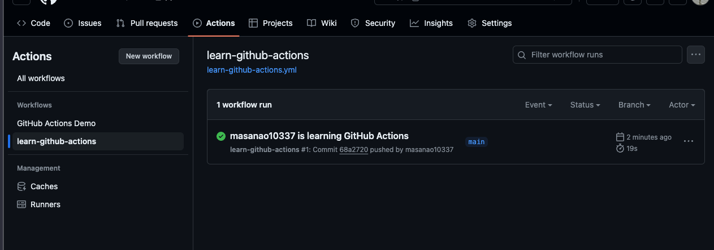

---
tags:
  - github-actions
  - workflow
  - ci
  - cd
created: 2026-02-06
status: active
---

# GitHub Actions 基本概念

## 基本的な用語の理解

- **Workflows**

1つ以上のジョブを実行する、自分で構成可能な自動化プロセスのこと。

yamlファイルによって定義されて、リポジトリのイベントによってトリガーされた時に実行される。

手動でのトリガやスケジューラを使うこともできる。

- **イベント**

ワークフロー実行をトリガーする、リポジトリ内の特定のアクティビティです

pull requestが作成された時。

- **ジョブ**

ジョブは、同じランナーで実行される、ワークフロー内の一連の _ステップ_ です。各ステップは、実行されるシェルスクリプト、または実行される _アクション_ のいずれかです。

- **アクション**

_アクション_ は、GitHub Actions用のカスタムアプリケーションであり、複雑で頻繁に繰り返されるタスクを実行します。アクションを使用すると、ワークフローファイルに記述する繰り返しコードの量を削減するのに役立ちます

- **ランナー**

ワークフローがトリガーされると実際にジョブを実行するサーバのこと。

## アクションの基本構造

```text
- workflow
  - job1
    - step1
    - step2
  - job2
    - step1
    - step2
```

cf. [https://www.youtube.com/watch?v=sx-aIgP2S00](https://www.youtube.com/watch?v=sx-aIgP2S00)

## YMLの書き方

```yaml
name: learn-github-actions #(optional) Actionsタブに表示されるワークフローの名前
run-name: ${{ github.actor }} is learning GitHub Actions #(optional)
on: [push]
jobs:
  check-bats-version:
    runs-on: ubuntu-latest
    steps:
      - uses: actions/checkout@v4
      - uses: actions/setup-node@v4
        with:
          node-version: "20"
      - run: npm install -g bats
      - run: bats -v
```

### nameとrun-nameの違いについて



`name`: ワークフロー自体の名前（静的）
`run-name`: 個々のワークフロー実行に表示される名前（動的に変更可能）

## アクション

参考：[アクションで入出力を使用する](https://docs.github.com/ja/actions/learn-github-actions/finding-and-customizing-actions?learn=getting_started&learnProduct=actions#using-inputs-and-outputs-with-an-action)

## 構文チートシート

[https://docs.github.com/ja/actions/using-workflows/workflow-syntax-for-github-actions](https://docs.github.com/ja/actions/using-workflows/workflow-syntax-for-github-actions)

## より詳しい情報

### ワークフローについて

[ワークフローについて - GitHub Docs](https://docs.github.com/ja/actions/using-workflows/about-workflows?learn=getting_started&learnProduct=actions)

トリガー、構文、高度な機能など、GitHub Actionsのワークフローの概要について説明します。

### 高度なワークフロー機能

- シークレットの保存
- 依存ジョブの作成
- マトリックスを使用
- 依存関係のキャッシング

[高度なワークフロー機能 - GitHub Docs](https://docs.github.com/ja/actions/using-workflows/about-workflows?learn=getting_started&learnProduct=actions#advanced-workflow-features)

## 参考リンク

- [GitHub Actions公式ドキュメント](https://docs.github.com/ja/actions)
- [ワークフロー構文リファレンス](https://docs.github.com/ja/actions/using-workflows/workflow-syntax-for-github-actions)
