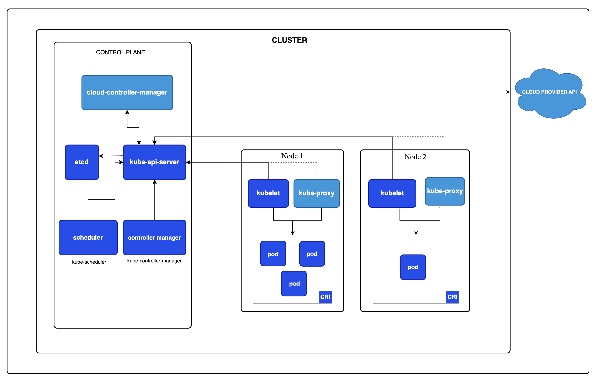

# Kubernetes とは

"宣言的"(declarative)ツール。手続き型ツールとして Ansible とかがあるらしい。
"Desired State"を定義するツールです。

## Kubernetes の特徴

1. Reconciliation Loop によって、障害から自動復旧を試みる
   Desired State になるように自動で動く

> reconciliation: 和解、調和などの意味
> cf. [https://ejje.weblio.jp/content/reconciliation](https://ejje.weblio.jp/content/reconciliation)

1. IaC としてインフラ設定を yaml で管理できる
   設定用の yaml ファイルは、マニフェストと呼ぶらしい。
   コンテナの仕様(最小メモリなど)を Iac としてマニフェストに記述することで、個別に管理する必要がなくなります。

1. KubernetesAPI がインフラレイヤを抽象化するため、サーバ固有の設定を知る必要がない。
   OS の種類や外部公開の手段などが書かれなくて済む

```yaml
apiVersion: v1
kind: Service
metadata:
  name: my-service
spce:
  type: NodePort
  selector:
    app.kubernetes.io/name: myapp
  ports:
    - port: 80
      targetPort: 80
      nodePort: 30007
```

## kubernetes のアーキテクチャ

大きく分けると Control Plane Worker Node がある。
重要な要素として、"Control Plane は Worker Node を直接指示しない”というものがある。
Worker Node が Controle Plane に問い合わせる方式を取ることで、Controle Plane が壊れても、即座に WorkerNode 上に起動するコンテナが破壊されるわけではない。



## Control Plane

(Pod のスケジュール先など)の決まった内容が Control Plane によって決められる

## Worker Node

実際にコンテナを起動する。

## 主な Kubernetes クラスタ構築方法

- ローカル
- クラウドベンダー

## Pod という概念

コンテナーの集合
