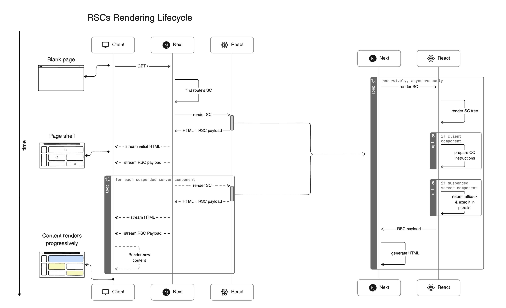

---
tags:
  - react
  - component
  - styling
  - server
created: 2026-01-03
updated_at: 2026-02-25
status: active
---

# renderingってなんだ？

レンダリングとは、日本語にすると描画する。とか訳される。これはbrowser rendering(paintと表現したりする。)

ただし、browserがHTMLをcssやJSと一緒に表示する。ときに言われる描画する。とは異なります。

`rendering engine`でいわれる内容とも少し異なるらしい。

## React語としてのrender

**「レンダー」とは、React がコンポーネントを呼び出すことです。**

[レンダーとコミット – React](https://ja.react.dev/learn/render-and-commit)

ただし！SSRで登場で、Hydrationという概念とともに、serverでstatic HTMLが生成されるようになりました。

CSR ↔ SSR

SSRが SSG/ ISR/ RSC

## 業界標準の理解 ✅

Next.js公式ドキュメント(最新)やReact公式ドキュメントでは:

- **Client Components** = "クライアント側でインタラクティブ性が必要なコンポーネント"

- サーバーとクライアントの両方でレンダリングされる

- SSR + Hydrationのハイブリッドアプローチ

dynamic renderingとは？SSGについて

